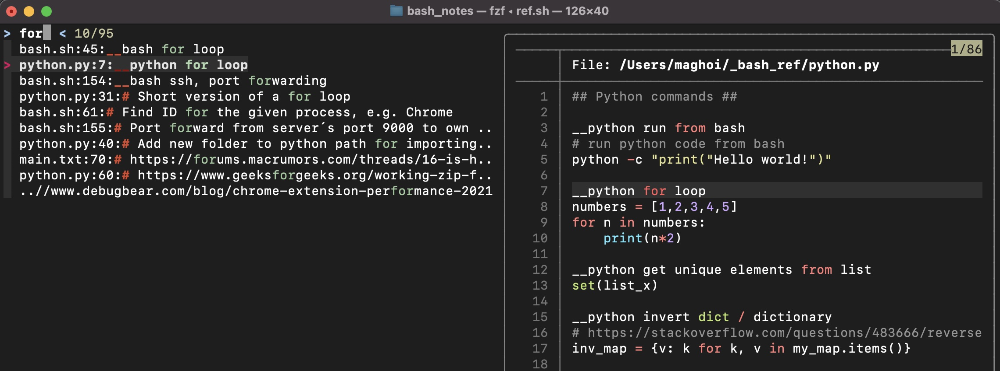

<!-- PROJECT SHIELDS -->
[![Contributors][contributors-shield]][contributors-url]
[![Forks][forks-shield]][forks-url]
[![Stargazers][stars-shield]][stars-url]
[![Issues][issues-shield]][issues-url]
[![MIT License][license-shield]][license-url]

<!-- PROJECT LOGO -->
<br />
<p align="center">
  <a href="https://github.com/Magnushhoie/FuzzyNotes">
  </a>

  <h1 align="center">FuzzyNotes</h3>

  <p align="center">
    Ultra-fast, <a href="">terminal based</a> note searching and editing app powered by <a href="https://github.com/junegunn/fzf">FZF</a> and <a href="https://danielmiessler.com/study/vim/">vim.</a> Click to watch tutorial:

  </p>
</p>

<p align="center">

</p>


### What is FuzzyNotes?

FuzzyNotes solves the problem of losing notes, code or things you want to remember. Where was it written, which file and is it even there?

**fz** interactively fuzzy searches across all text files in the $HOME/_FuzzyNotes directory. The search terms can be changed with instant results, and results previewed in the sidebar.

**fze** is similar, but opens the file exactly where you last edited it, in Vim.

Typical use-cases are when starting a new project, writing a log-book or noting down code-snippets. FuzzyNotes integrates with any collection of text files, such as with Obsidian or other knowledge management programs.

**The philosophy of FuzzyNotes is accessing all information, with as little effort as possible.**


### Features:
- Interactively search / edit / view note files in ~/_FuzzyNotes/ directory (powered by FZF)
- Instantly preview file contents and search match in side-bar
- Code highlighting
- Partial search matches
- Quickly return to last changed location in file
- First keywords can be filenames or keywords
- (not implemented) image and markdown support inside the terminal

## Installation

Sets up notes directory and adds aliases to ~/.bash_profile or ~/.zshrc.

```bash
# Requirements
brew install fzf
brew install bat

# Install
git clone https://github.com/Magnushhoie/FuzzyNotes/
cd FuzzyNotes
bash setup.sh
```

## Usage
- fz: Interactively search across all note files (default in ~/_FuzzyNotes/ directory)
- fze: List available files and their content, open file in vim on default system editor

See [notes.txt](_FuzzyNotes/notes.txt) for example note file.

## Documentation

Use "**fz --help**" for all arguments.

#### fz - "Fuzzy look-up", search and view

```bash
usage: fz [file] keywords
  keywords: Search terms, space-separated
  file: Optional, filename (without extension) in note folder

Example usage:
# Interactively search / preview / open files for selected lines starting with __ or #:
fz

# Search across all files for "list"
fz list
  
# Search across all lines (not just starting with __ or #)
fz -f

# Search python.py in note folder for "list" "comprehension"
fz python list comprehension
```

#### fze - "Fuzzy edit", search and edit

```bash
usage: fze [file] keywords
  keywords: Search terms, space-separated
  file: Optional, filename (without extension) in note folder

Example usage:
# List files in notes folder, select for opening (returns to last edited line)
fze

# Search python.py for lines starting with "for loop", open at selected line in vim
fze python for loop
  
# Open notes folder
fze --open
  
# Open specific file in system editor
fze --open notes.txt

# Add new_note.txt
fze -n new_note.txt
```

## Testing

```bash
bash test/test.sh
```

## Compatibility
Compatible with zsh. Tested on MacOS Mojave/Big Sur and Ubuntu 21.04.

## Contributing
Pull requests are welcome. For major changes, please open an issue first to discuss what you would like to change.

Please make sure to update tests as appropriate.

## License
[MIT](https://choosealicense.com/licenses/mit/)

<!-- MARKDOWN LINKS & IMAGES -->
<!-- https://www.markdownguide.org/basic-syntax/#reference-style-links -->
[contributors-shield]: https://img.shields.io/github/contributors/Magnushhoie/FuzzyNotes.svg?style=for-the-badge
[contributors-url]: https://github.com/Magnushhoie/FuzzyNotes/graphs/contributors
[forks-shield]: https://img.shields.io/github/forks/Magnushhoie/FuzzyNotes.svg?style=for-the-badge
[forks-url]: https://github.com/Magnushhoie/FuzzyNotes/network/members
[stars-shield]: https://img.shields.io/github/stars/Magnushhoie/FuzzyNotes.svg?style=for-the-badge
[stars-url]: https://github.com/Magnushhoie/FuzzyNotes/stargazers
[issues-shield]: https://img.shields.io/github/issues/Magnushhoie/FuzzyNotes.svg?style=for-the-badge
[issues-url]: https://github.com/Magnushhoie/FuzzyNotes/issues
[license-shield]: https://img.shields.io/github/license/othneildrew/Best-README-Template.svg?style=for-the-badge
[license-url]: https://github.com/Magnushhoie/FuzzyNotes/blob/master/LICENSE.txt
